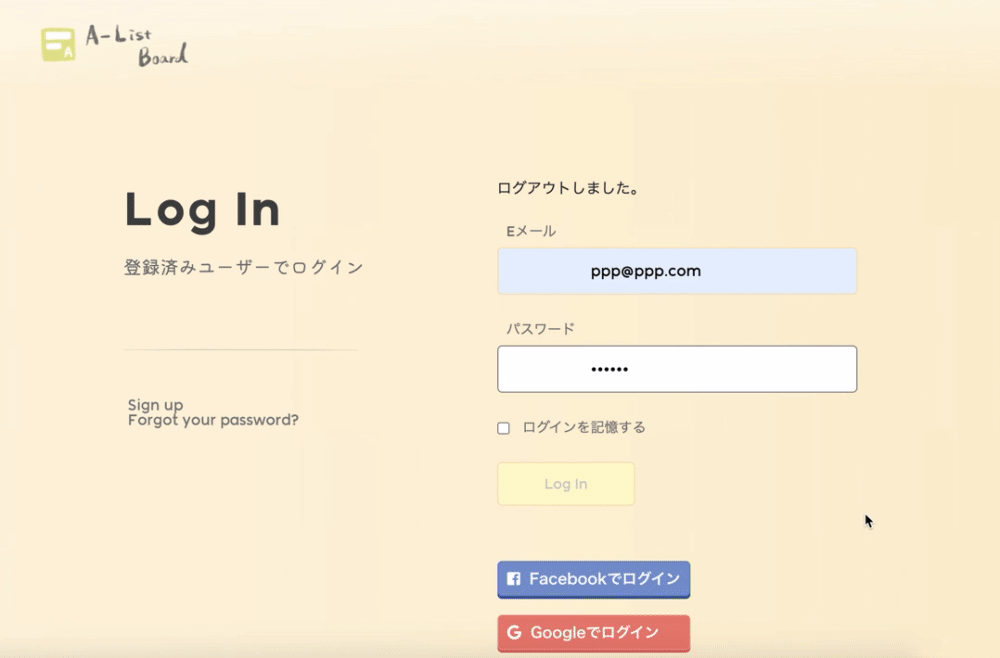
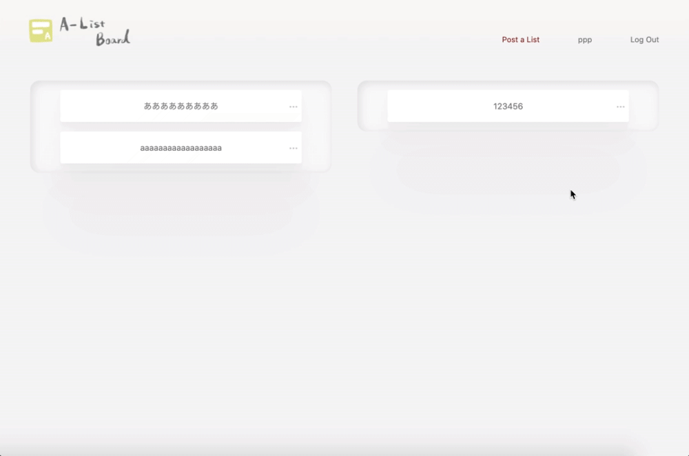
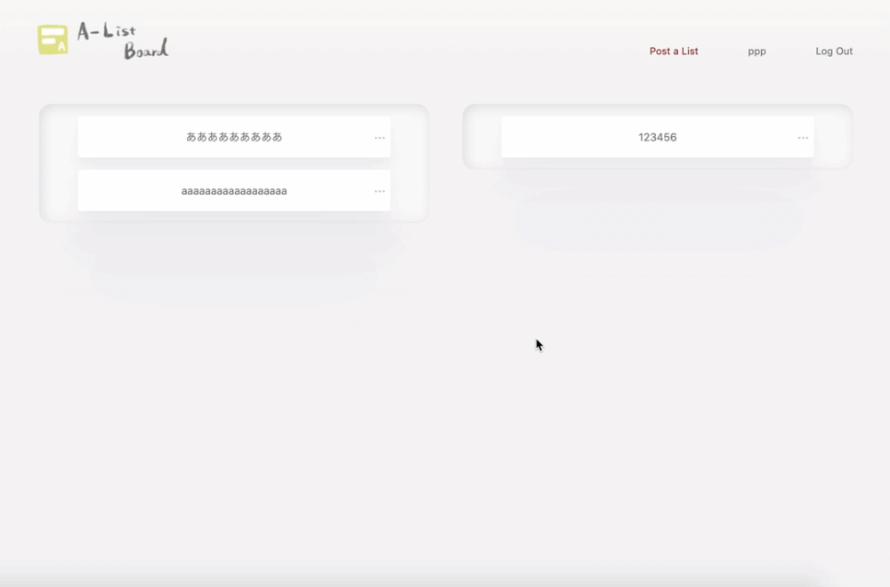
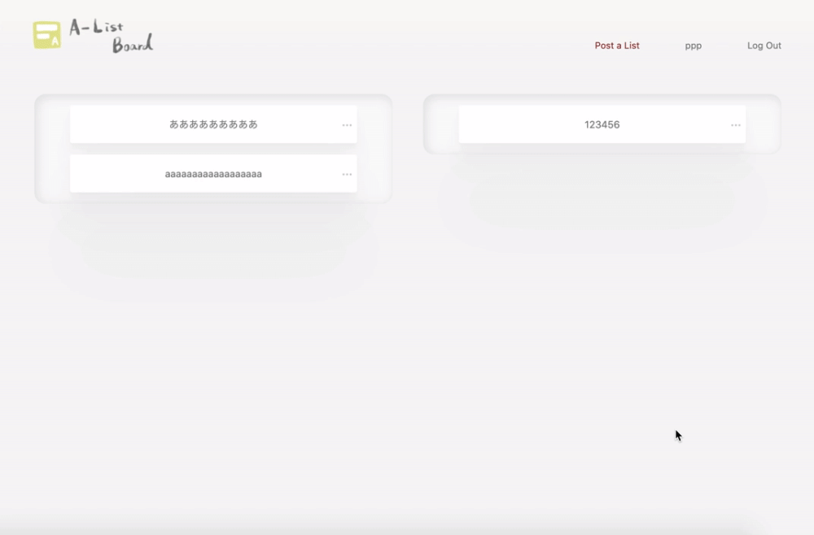

# :name_badge: Name

 
 

# :book: Overview

サイトなどに登録している情報を管理するアプリケーション  

制作背景（意図）

自分がどれだけのサイトに登録しているのか、どのアドレスを使用しているのか一覧で確認できたら便利だと考え作成した。  
一覧で見えることで、不要なアカウントの整理がしやすくなる。

 

### :pushpin: Production Environment

https://www.a-list-board.com/

Login Info (sample)
- E-mail：sample@sample.com
- Password：sample1
 
 

# :movie_camera: Demo

### Home

Describe

- ルートパスに設定しているページ
- ページ下部にログインとサインアップのリンクがある
- フッターにはサイトについて書かれた簡易的なページへのリンクがある
- ログイン状態でこちらのページにいるとヘッダーにはMy Boardとログアウトのリンクが出現する

 
 

### Login/SignUp view

Describe

- SNSアカウントでのログインが可能

 
 

### My Board

Describe

- ログインするとこちらのページへ遷移
- ヘッダーには投稿/ユーザー情報/ログアウトのリンクがある
- 投稿されたリストが一覧表示される
- 左右それぞれ無料/有料で別れて表示される

 
 

### Post view

Describe

- リストの投稿ができる
- 項目はタイトル/URL/メールアドレス/パスワード/料金形態/メモ
- 必須となるのはタイトルと料金形態のみ

 
 

### Detail view

Describe

- 投稿したリストの詳細情報がモーダルウィンドウで表示される
- リストをクリックして表示し、モーダルが表示されたら×かマスク部分をクリックすると非表示になる

 
 

### Edit/delete view

Describe

- リスト一覧で該当リストの右端にある•••に触れると編集と削除のリンクが出現する
- 詳細画面の右上にも編集と削除のリンクアイコンがある
- 編集画面は投稿画面と変わらず、削除リンクを踏むと確認ダイアログが出現する

 
 

# :rocket: Requirement
 

- Ruby 2.6.5
- Ruby on Rails 6.0.0
- HTML 5
- CSS
- PHP
- jQuery 4.4.0
- Bootstrap 4.5.2  
 

- MySQL / Sequel Pro / MariaDB
- AWS(EC2) / Capistrano / nginx / unicorn
- GitHub / GitHubDesktop
- RSpec  
 

- VScode
 
 

# :thought_balloon: Note

### 工夫したポイント
機能を絞って必要最低限のシンプルなアプリケーションにするようにした。  
使用者が使いやすいように非同期での表示をするようにした。
 

### To Do

アカウント削除を物理削除ではなく論理削除にする
一度削除したユーザーが再度同じメールアドレスでの登録も可能にさせる

レスポンシブデザイン
スマートフォンやタブレットからのアクセスに対応させる

動的フォームの実装
料金形態が有料を選択した場合に入力フォームが増えるようにする

モーダルウィンドウの追加

- 編集画面を詳細モーダルと同じようなモーダルにする
- 投稿画面についてもモーダルから可能にする

ドラッグ&ドロップでのリストの移動
簡単に並び替えができるようにするため実装する

 
 

# :clipboard: Tables

## users

| Column   | Type   | Options     |
| -------- | ------ | ----------- |
| nickname | string | null: false |
| email    | string | null: false |
| password | string | null: false |

### Association

- has_many :lists
 

## lists

| Column   | Type       | Options                        |
| -------- | ---------- | ------------------------------ |
| title    | string     | null: false                    |
| email    | string     |                                |
| password | string     |                                |
| fee      | string     | null: false                    |
| memo     | text       |                                |
| user     | references | null: false, foreign_key: true |

### Association

- belongs_to :users
- has_one :subscriptions
 

## subscriptions

| Column | Type       | Options                       |
| ------ | ---------- | ----------------------------- |
| plan   | string     |                               |
| price  | integer    | null: false                   |
| list   | references | null:false, foreign_key: true |

### Association

- belongs_to :lists